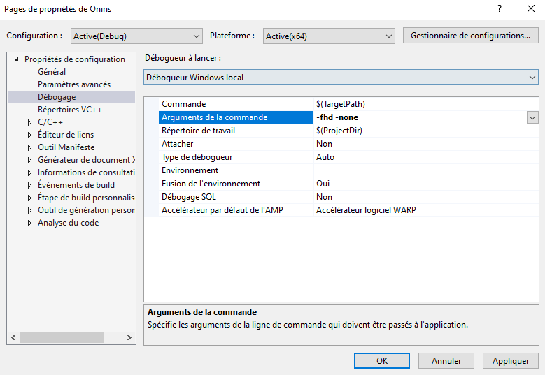
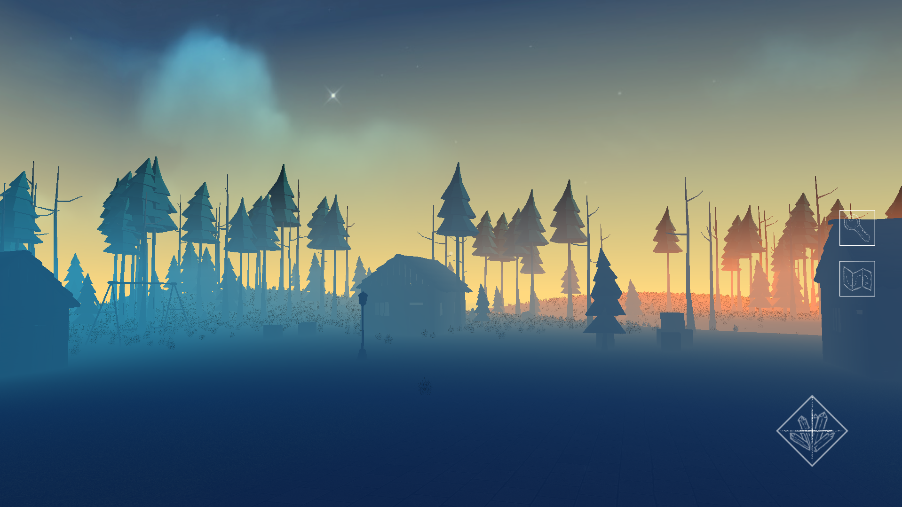

# Oniris

## About

* Oniris is an Complative Exploration Game in C++ using OpenGL 3.3
* Project status: working prototype
* authors : Emma Vodable & Thomas Zorroché

## Compilation

### Windows (using Visual Studio)

In repo directory, type in command line : 
``` bash
mkdir build
cd build
cmake "Visual Studio 16 2019" ..
```

Open '/build/Oniris.sln' and build Oniris project in Visual Studio.

For custom size add flags `-hd` or `-fhd`
For custom warning add flags `-none` `-info` `-warning` or `error` 



### Linux (using g++)

First, make sure you have `g++` and `cmake`  installed by typing, in terminal : 
``` apt-get install g++ cmake git ```

Then, get the required packages : 
``` apt-get install libsoil-dev libglm-dev libassimp-dev libglfw3-dev libxinerama-dev libxcursor-dev libxi-dev  ```

Create and navigate to 'build/' directory:
```mkdir build && cd build```

In repo directory, type in command line : 
``` bash
cmake ..
make 
```

To execute the program use :
Make sure to be in the root directory of Oniris :
``` cpp
bin/Oniris -fhd -none // window size in full HD and no warning
bin/Oniris -hd -error // window size in HD and all warning
```

## More ...

### Screenshots



![[screenshot02]](doc/Oniris02.PNG)

![[screenshot03]](doc/Oniris04.PNG)

You'll have a better overview (in French) of the project in 'doc/Rapport_Oniris.pdf' 